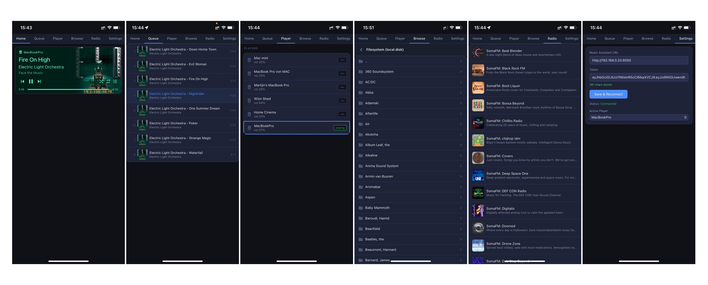

# Music Assistant Mobile

A standalone mobile web app for [Music Assistant](https://github.com/music-assistant) designed for iPhone, inspired by the MA Home Assistant addon player.



## Features

- **Home** — Full player card with album art, track info, progress bar, playback controls, shuffle & repeat, volume — color themed from album art
- **Queue** — Live queue list, auto-updates when a new album or playlist starts
- **Player** — Select your active player, saved across sessions
- **Browse** — Drilldown file browser starting at your local disk provider. Tap folder icon to navigate, tap folder name to play all contents
- **Radio** — List of all MA radio stations, tap to play instantly
- **Settings** — Configure MA server URL and token

## Tech Stack

- Vue 3 (no router, single page)
- Vite
- Node.js static file server with image proxy
- WebSocket connection to Music Assistant server

## Setup

```bash
npm install
npm run build
node serve.js
```

The app runs on port `3001` and is accessible at `http://localhost:3001`.

## iPhone Home Screen

Add to your iPhone home screen via Safari → Share → Add to Home Screen for a full-screen native-like experience.
